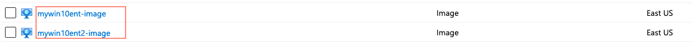
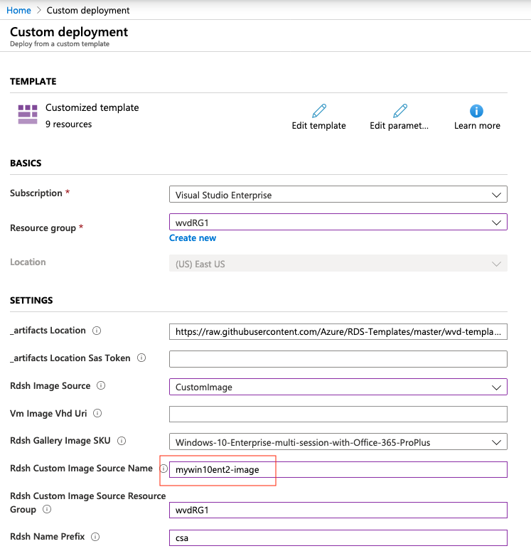
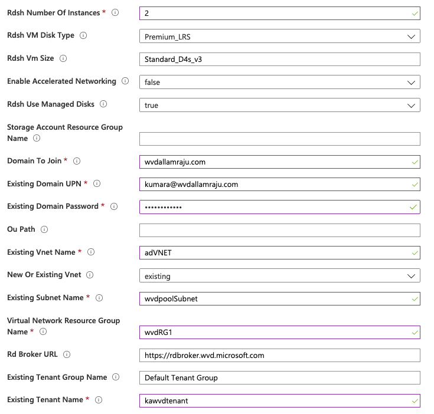
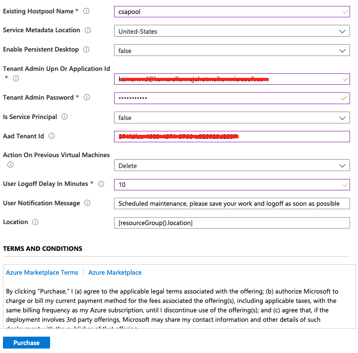

#How to push new custom images to an existing WVD host pool?

***Usecase:***
One of my team members asked me if there's a way to push new custom images to an existing WVD host pool. I didn't have an answer right off the bat but felt this was a good use case to explore.

As of today there is no GUI option in Azure Portal to push an updated image to an existing WVD host pool.  Our WVD Azure PG worked on an ARM template that can be used to accomplish this task.

You will find the ARM template at [this github repo](
https://github.com/Azure/RDS-Templates/blob/master/wvd-templates/Update%20existing%20WVD%20host%20pool/README.md)

You can deploy this ARM template in your Azure subscription. I have pasted the screenshots below.

1. I have created 2 custom images. Refer to the following screenshot

2. First I have a provisioned a host pool (e.g. csapool) with a custom image (e.g mywin10ent-image)

3. Now the company has a new custom image that includes new applications or updates to existing ones.

4. Use the ARM template stated above and input the data in the relevant fields. This deployment pushes an updated image to an existing host pool. You have an option to either delete or deallocate the existing VMs. A custom notification can also sent for the users who are working on the active sessions.

